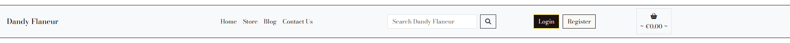
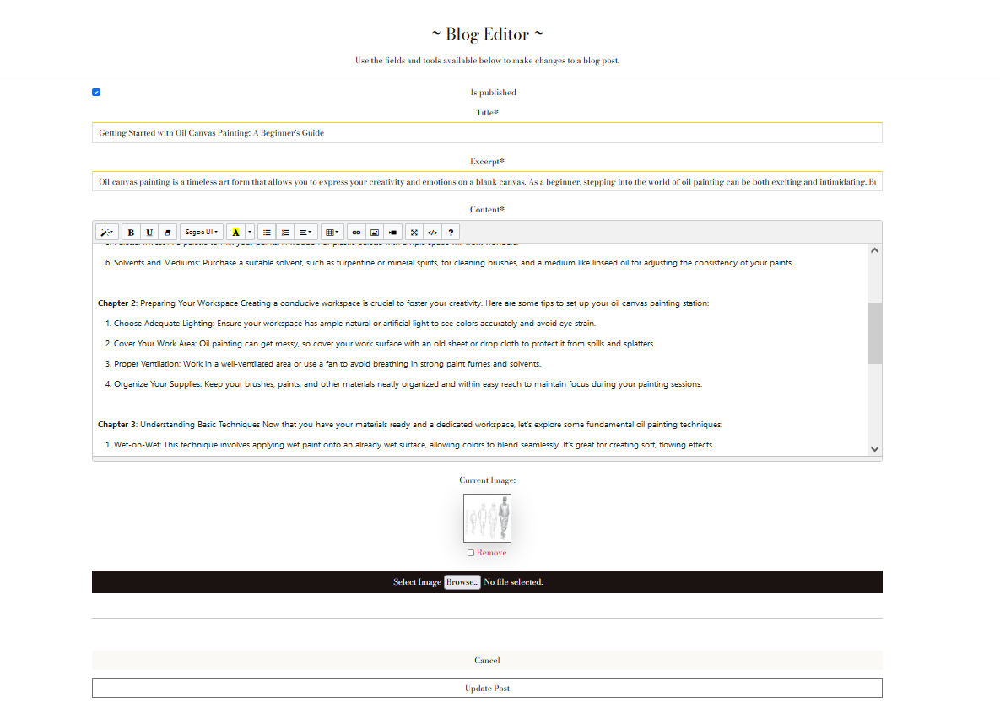
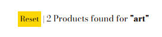
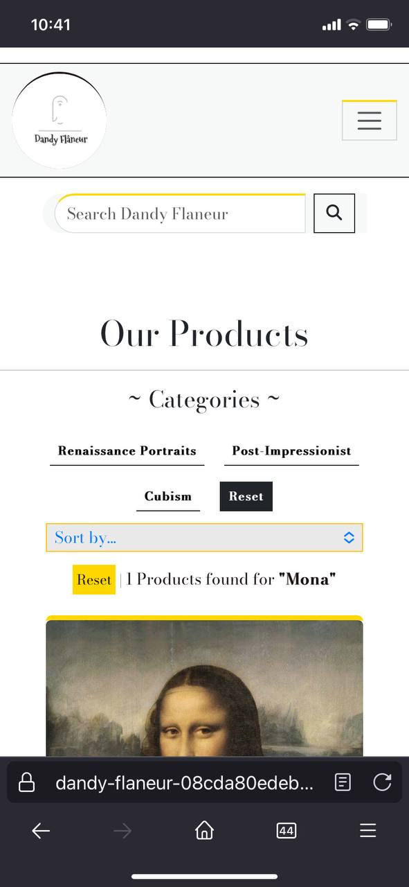

# Dandy Flaneur – Portfolio Project 5


***[Link to live web application](https://dandy-flaneur-08cda80edeb8.herokuapp.com/)***

## Project Documentation
### Welcome to [Dandy Flaneur](https://dandy-flaneur-08cda80edeb8.herokuapp.com/)

## Table of Contents
- [Proof of Concept](#proof-of-concept)
    -   [Mission and Vision](#mission-and-vision)
    -   [Target Market](#target-market)
    -   [Financial Outlook](#financial-outlook)
    -   [Product Offerings](#product-offerings)
    -   [Sales Strategy](#sales-strategy)
    -   [Community and Blog](#community-and-blog)
    -   [Marketing Strategy](#marketing-strategy)

-   [User Experience (UX)](#user-experience-ux)
    -   [User Stories](#user-stories)
    -   [Typography](#typography)
    -   [Colour Palette](#colour-palette)
    -   [Wireframes](#wireframes)

-   [Web Marketing](#web-marketing)
    -   [Social Media](#social-media)

-   [Agile Development](#agile-development)
    -   [MoSCow](#moscow-prioritization-system)

- [Technical Design](#technical-design)
    -   [Entity Relationship Diagram](#entity-relationship-diagram)
    -   [Data Model](#data-models)

-   [Website Features](#website-features)
    -   [Application Elements](#application-elements)

-   [Future Features](#future-features) 

-   [Testing](#testing)
    -   [Manual Testing](#manual-testing)
        -   [User Stories Testing](#user-stories-testing)
    -   [Automated Testing](#automated-tests)
        -   [Unit Tests](#unit-tests)
    -   [Performance](#performance)
    -   [Browser Compatability](#browser-compatability)
    -   [Responsivity](#responsivity)

-   [Validation](#validation)
    -   [HTML](#html)
    -   [CSS](#css)
    -   [JavaScript](#javascript)
    -   [Python](#python)

-   [Bug Fixes](#bug-fixes)

-   [Deployment](#deployment)
    -   [Local Deployment](#local-deployment)
    -   [Heroku Deployment](#heroku-deployment)

-   [Technologies Used](#technologies-used)
    -   [Hardware](#hardware)
    -   [Software](#software)
    -   [Platforms](#platforms)
    -   [Libraries](#libraries)
        -   [Local Libraries](#local-libraries)
        -   [Third Party Libraries](#third-party-libraries)

-   [Credits and References](#credits-and-references)
    -   [Repositories](#repositories)
    -   [Code Troubleshooting](#code-troubleshooting)
    -   [Documentation](#documentation)
    -   [Library Information](#library-information)
    -   [Theory](#theory)

-   [Acknowledgements](#acknowledgements)

-   [Closing Remarks](#closing-remarks)

---
## Proof of Concept

### Executive Summary: Dandy Flaneur

Dandy Flaneur is an innovative and customer-centric company that specializes in the sale of exquisite paintings and artwork, with a particular focus on oil paintings. We also offer a wide selection of high-quality painting equipment to cater to the diverse needs of artists and art enthusiasts. Our primary goal is to establish Dandy Flaneur as a common destination for shoppers in Ireland seeking quality artwork and reliable painting supplies.

### Mission and Vision
Our mission at Dandy Flaneur is to enrich people's lives by providing them with beautiful and inspiring artwork that enhances their living spaces and personal aesthetics. We envision fostering a vibrant and inclusive community of artists and art lovers, where creativity and passion are on the forefront.

### Target Market
Our primary target market includes art enthusiasts, interior designers, collectors, and aspiring artists across Ireland. By offering a mix of traditional and contemporary artwork, we aim to capture a broad audience that appreciates art's beauty and value. Dandy Flaneur repsresents a niche market with a dedicated customer-base. Establishing a meaningful connection with the members of the art industry will allow for more sales and a positive consistency in B2C relationships.

### Financial Outlook
Our revenue model centers on store sales, ensuring a stable and sustainable income stream. As Dandy Flaneur gains traction and establishes itself as a reputable brand in Ireland, we anticipate steady growth and expanded market reach.

### Product Offerings
We curate a diverse collection of paintings, spanning various styles and genres, to cater to different tastes and preferences. Our handpicked selection of oil paintings showcases the skill and craftsmanship of talented artists from around the world. Additionally, we offer a comprehensive range of top-notch painting equipment, ensuring artists have access to the finest tools to bring their visions to life.

### Sales Strategy
Dandy Flaneur operates an online platform, providing customers with convenient access to our offerings. Our store is designed to provide an immersive and welcoming experience. We aim to offer competitive pricing and exceptional customer service to ensure customer satisfaction and loyalty.

### Community and Blog
Dandy Flaneur is not just a place to buy artwork and supplies but also a hub for artistic inspiration and education. Our blog features engaging content, including artist spotlights, art techniques, and insightful articles. By fostering a strong community around our brand, we aim to connect with our customers on a deeper level and create lasting relationships.

To conclude, Dandy Flaneur is dedicated to becoming a trusted provider of quality artwork and painting equipment in Ireland. Through our commitment to quality, creativity, and community-building, we aim to enrich lives with art while creating a vibrant and enduring business venture.

### Marketing Strategy

***Web Marketing***

We recognize the significance of our website as the digital storefront for Dandy Flaneur. To maximize its impact, we have implemented a strategic web marketing plan. This includes employing search engine optimization (SEO) techniques to enhance our online visibility, ensuring that art enthusiasts can easily find our platform when searching for quality artwork and painting equipment. Additionally, we prioritize creating engaging and informative content that showcases our curated collection of paintings, spotlighting talented artists, and providing insights into various art styles and techniques.

***Social Media Marketing***

Social media platforms play a pivotal role in our marketing efforts. Through thoughtfully crafted social media marketing campaigns, we connect directly with our target audience, art enthusiasts, collectors, and aspiring artists. By leveraging popular platforms like Facebook and Instagram, we share captivating visuals, behind-the-scenes glimpses into our art curation process, and interactive content that fosters a sense of community. Building a strong social media presence enables us to spark conversations, gather valuable feedback, and establish Dandy Flaneur as a common destination for art enthusiasts in Ireland.

***Customer Queries***

We place great emphasis on addressing customer queries promptly and professionally. By valuing each customer interaction, we aim to build trust and loyalty, ensuring that our clients feel valued and supported throughout their purchasing journey. Our commitment to responsive customer service strengthens our reputation and fosters positive word-of-mouth recommendations.

***Newsletter Emails***

Staying connected with our audience is vital to nurturing relationships and driving repeat business. Our newsletter emails powered by Mailchimp serve as a powerful tool to keep subscribers informed about new arrivals, upcoming promotions, exciting events, and captivating blog content. Through personalized and segmented email campaigns, we deliver content that resonates with individual preferences, further deepening engagement with our brand.

---
## User Experience (UX)

### User Stories

#### EPIC #1 - User Registration and Accounts

`(MUST HAVE)`

- As a user I can login and logout so that I can access a personal account on the site for rapid access to relevant shop features.
- As a user I can create and view a profile page so that I input and save relevant personal information for faster checkouts.
- As a user I can register an account on the site so that I have a personal account with a unique profile.
- As a user I can reset my password so that I can set a new password for my account whenever I need to do so.
- As a user I can be sent a confirmation email from the site once I create an account so that I am notified that my account registration was successful.

#### EPIC #2 - Site Viewing and Navigation

`(MUST HAVE)`

- As a shopper, I can navigate across the site so that I can access all relevant elements of the site.
- As a shopper I can use header and footer to access navigation, menus and Social Media links.
- As a shopper I can receive a dedicated notification in response to my actions so that I get real-time feedback about the status of my actions.
- As a shopper I can access a list of products available so that I can choose an item to buy.
- As a shopper I can view a welcome page so that I am introduced to the business and its products.
- As a shopper I can access details for a specific product so that I can better inform myself about the item to help with making a purchase decision.
- As a shopper I can view a readout of my login status that is visible at all times so that I can confirm my authentication whenever I want.
- As a shopper I can add new items to my basket so that I list the items that I want to buy.
- As a shopper I can view available booking times for workshops so that I can decide if they fit my schedule.
- As a shopper I can view a list of workshop classes so that I can easily inform myself of the experiences available on offer.
- As a shopper I can make changes in my basket so that I can make the exact purchase that I want.
- As a shopper I can remove items so that I don't accidentally purchase items that I don't want.
- As a shopper I can submit my email with a message attached so that I can establish a personal correspondence with the company about a specific topic.

`(SHOULD HAVE)`

- As a shopper I can view a page with all the relevant details of a workshop so that I can decide if it fits my interests.
- As an admin I can post, edit and remove blog content so that users can read about various topics relevant to the context of the site.
- As a user I can view well-formated layouts so that I can have a coherent visual experience while using the website.

`(COULD HAVE)`

- As a user I can leave comments on blog articles so that I can share my views and opinions about the matters discussed in the blog posts.
- As a viewer I can leave likes so that I can express my fondness for a blog post anonymously.

#### EPIC #3 - Content Sorting and Searching

`(MUST HAVE)`

- As a shopper I can put in keywords into a search bar so that I receive a page with all relevant products to my interests.

`(SHOULD HAVE)`

- As a shopper I can search for a specific item by entering its name or description so that I can precisely find the product that I am looking for.
- As a shopper I can sort products on the basis of their assigned categories so that I can focus on items that fit into categories that I am interested in.
- As a shopper I can sort products by price so that I can easily view products that are appropriate to my financial capabilities.

#### EPIC #4 - Stripe Payments and Checkout

`(MUST HAVE)`

- As a shopper I can easily access my shopping bag so that I can check the items that I will be purchasing whenever I need to.
- As a shopper I can receive a notification about the status of my order confirmation so that I am sure my payment went through and my order was placed successfully.
- As a shopper I can use my card to pay for my order so that I don't have to worry about alternative payment methods.
- As a shopper I can select the specific size and quantity preferences on the product page so that I can put exactly what I want in my shopping basket.

`(SHOULD HAVE)`

- As a shopper I can increase or decrease the quantities of items in my basket so that I can buy more or less of the product I want.

`(COULD HAVE)`

- As a shopper I can receive an email confirming my order with relevant details so that I can be sure that my order was processed successfully.

#### EPIC #5 - Administrator Features and Store Management

`(MUST HAVE)`

- As an admin I can add a new product so that I can update items available in the shop. 
- As an admin I can remove a product item from the store so that users don't have access to inactive products.
- As an admin I can change product details so that the relevant item has the most accurate and up-to-date information associated with it on the website.

`(COULD HAVE)`

- As an admin I can add a workshop so that users can view new experiences.
- As an admin I can change the details of a workshop as needed so that they represent the most accurate and relevant information to the users.
- As an admin I can remove a redundant workshop from the website so that users are not misled into inactive workshops.
- As an admin I can add more time slots to workshops so that users can benefit from added time availability.
- As an admin I can change booking time slot information so that users have the most accurate information.
- As an admin I can remove time slots as needed so that workshop details represent the most accurate availability information.

#### EPIC #6 - Web Marketing and Search Engine Optimization

`(MUST HAVE)`

- As a shopper I can find the correct site by searching it online so that I don't have to worry about opening an unrelated website.
- As a shopper I can submit my email so that I can receive information about deals and product insights from the company.


### Typography

- [Bodoni Moda](https://fonts.google.com/specimen/Bodoni+Moda?query=Bodoni+Moda) is the primary font that is present across all textual elements present in the project.
    - 

- [EB Garamond](https://fonts.google.com/knowledge/glossary/sans_serif) is the fallback font set in case the primary font fails.
    - 

### Colour Palette

[Coolors](https://coolors.co/) was a highly beneficial resource that provided significant help in identifying matching colours that also have appropriate contrast.

More importantly, this colour combination consists of items designed to motivate excitement and aesthetic pleasure from users through the use of minimalist design elements coupled with a clean page formating.


---

### Wireframes

<details>

<summary>Home Page</summary>

#### Mobile


#### Tablet


#### Desktop


</details>

<details>

<summary>Blog Page</summary>

#### Mobile


#### Tablet


#### Desktop


</details>

<details>

<summary>Blog Detail Page</summary>

#### Mobile


#### Tablet


#### Desktop


</details>

<details>

<summary>Store Page</summary>

#### Mobile


#### Tablet


#### Desktop


</details>

<details>

<summary>Store Detail Page</summary>

#### Mobile


#### Tablet


#### Desktop


</details>

<details>

<summary>Contact Us Page</summary>

#### Mobile


#### Tablet


#### Desktop


</details>

<details>

<summary>Basket Page</summary>

#### Mobile


#### Tablet


#### Desktop


</details>

<details>

<summary>Checkout Page</summary>

#### Mobile


#### Tablet


#### Desktop


</details>

<details>

<summary>Checkout Success Page</summary>

#### Mobile


#### Tablet


#### Desktop


</details>

<details>

<summary>Forms Page</summary>

- These wireframes illustrate the fundamental layout used in forms with one or more of editing, adding, and deletion functionalities.

#### Mobile


#### Tablet


#### Desktop


</details>

<details>

<summary>Authentication Page</summary>

- These wireframes represent the base design of all authentication pages that feature login, logout, and signup functionalities.

#### Mobile


#### Tablet


#### Desktop


</details>

<details>

<summary>Profile Page</summary>

#### Mobile


#### Tablet


#### Desktop


</details>

---

## Web Marketing

### Social Media

| Platform | Screenshot |
|------|------|
| Facebook ||
| Instagram ||

### Email Newsletter

| Platform | Screenshot |
|------|------|
| Mailchimp ||

---

## Agile Development

### MoSCoW Prioritization System

This project relies on agile methodology for its task management. This allows for more accurate estimation of time needed for successful task completion. You can access the kanban board used for this project [here](https://github.com/users/beratzorlu/projects/6)

Below are the labels used on GitHub to illustrate the various importance levels.

- Must Have: MVP feature (60% of user stories)
- Should Have: secondary importance (20% of user stories)
- Could Have: Tertiary importance (20% of stories)
- Won't Have: No longer in consideration

---

## Technical Design

### Entity Relationship Diagram

[Draw.io](https://www.drawio.com/) was a highly beneficial resource that provided significant help in building a ERP to illustrate the various table relationships of data models present in the project.


### Data Models

#### Blog/Post

| Field       | Type               | Description                       |
|-------------|--------------------|-----------------------------------|
| id          | Integer (Auto)     | Primary Key                       |
| author      | ForeignKey (User)  | Author of the post                |
| is_liked    | ManyToManyField    | Users who liked the post          |
| title       | CharField (200)    | Title of the post (Unique)        |
| slug        | SlugField (200)    | Unique slug for URL               |
| image       | ImageField         | Post image (nullable)             |
| excerpt     | TextField          | Excerpt of the post               |
| content     | TextField          | Content of the post               |
| created_on  | DateTimeField (auto)| Date and time of creation        |
| updated_on  | DateTimeField (auto)| Date and time of last update     |
| is_published| BooleanField       | Whether the post is published     |

#### Blog/Comment

| Field       | Type               | Description                       |
|-------------|--------------------|-----------------------------------|
| id          | Integer (Auto)     | Primary Key                       |
| name        | CharField (32)     | Name of the commenter             |
| post        | ForeignKey (Post)  | Post the comment belongs to       |
| author      | ForeignKey (User)  | Author of the comment             |
| content     | TextField          | Content of the comment            |
| created_on  | DateTimeField (auto)| Date and time of creation        |
| is_approved | BooleanField       | Whether the comment is approved   |

#### Checkout/Order

| Field           | Type                  | Description                                |
|-----------------|-----------------------|--------------------------------------------|
| id              | Integer (Auto)        | Primary Key                                |
| order_number    | CharField (32)        | Unique order number (generated with UUID)  |
| account_profile | ForeignKey (Profile)  | Account profile for the order (it is nullable)|
| full_name       | CharField (50)        | User's full name                       |
| email           | EmailField            | User's email                           |
| phone_number    | CharField (20)        | User's phone number                    |
| country         | CountryField          | Country of the User                    |
| eircode         | CharField (20)        | User's Eircode (it is nullable)        |
| town_or_city    | CharField (40)        | User's town/city                       |
| street_address1 | CharField (80)        | User's street address line 1           |
| street_address2 | CharField (80)        | User's street address line 2 (it is nullable)|
| county          | CharField (80)        | User's county (it is nullable)         |
| date            | DateTimeField (auto)  | Date and time of the order                 |
| delivery_cost   | DecimalField (6, 2)   | Delivery cost of the order                 |
| order_total     | DecimalField (10, 2)  | Total cost of the order                    |
| grand_total     | DecimalField (10, 2)  | Grand total (order_total + delivery_cost)  |
| original_basket | TextField             | Serialized original basket (it is nullable)|
| stripe_pid      | CharField (254)       | Stripe payment ID                          |

#### Checkout/OrderLineItem

| Field         | Type                  | Description                            |
|---------------|-----------------------|----------------------------------------|
| id            | Integer (Auto)        | Primary Key                            |
| order         | ForeignKey (Order)    | Order the line item belongs to         |
| product       | ForeignKey (Product)  | Product in the line item               |
| product_size  | CharField (8)         | Size of the product (Small, Medium, Large, Oversize) (it is nullable)|
| quantity      | IntegerField          | Quantity of the product                |
| lineitem_total| DecimalField (6, 2)   | Total cost of the line item            |

#### Profiles/AccountProfile 

| Field                | Type                  | Description                              |
|----------------------|-----------------------|------------------------------------------|
| id                   | Integer (Auto)        | Primary Key                              |
| user                 | OneToOneField (User)  | User associated with the profile         |
| default_phone_number | CharField (20)        | Default phone number of the user (it is nullable)|
| default_street_address1 | CharField (80)     | Default street address line 1 (it is nullable)|
| default_street_address2 | CharField (80)     | Default street address line 2 (it is nullable)|
| default_town_or_city | CharField (40)        | Default town/city of the user (it is nullable)|
| default_eircode      | CharField (20)        | Default Eircode of the user (it is nullable)|
| default_county       | CharField (80)        | Default county of the user (nullable)|
| default_country      | CountryField          | Default country of the user (it is nullable)|

#### Store/Category

| Field           | Type               | Description                         |
|-----------------|--------------------|-------------------------------------|
| id              | Integer (Auto)     | Primary Key                         |
| name            | CharField (254)    | Name of the category                |
| friendly_name   | CharField (254)    | Friendly name of the category       |


#### Store/Product

| Field           | Type               | Description                         |
|-----------------|--------------------|-------------------------------------|
| id              | Integer (Auto)     | Primary Key                         |
| upc             | CharField (50)     | Universal Product Code              |
| artist          | CharField (50)     | Artist name (nullable)              |
| country         | CharField (254)    | Country of the product (nullable)   |
| name            | CharField (254)    | Name of the product (Unique)        |
| description     | TextField          | Description of the product          |
| has_dimentions  | BooleanField       | Whether the product has dimensions  |
| price           | DecimalField (6, 2)| Price of the product                |
| category        | ForeignKey (Category)| Category of the product (nullable)|
| rating          | DecimalField (6, 1)| Rating of the product (nullable)    |
| image           | ImageField         | Product image (nullable)            |

#### Contact/ContactForm

| Field        | Type                  | Description                            |
|--------------|-----------------------|----------------------------------------|
| id           | Integer (Auto)        | Primary Key                            |
| user         | ForeignKey (User)     | User submitting the contact form (nullable)|
| form_id      | AutoField (Primary Key) | ID of the form (Auto-generated)      |
| date_created | DateTimeField (auto)  | Date and time of form submission       |
| sender_name  | CharField (50)        | Name of the sender                     |
| email_address| EmailField            | Email address of the sender            |
| phone_num    | PhoneNumberField      | Phone number of the sender (nullable)  |
| message      | TextField             | Content of the message                 |

---

## Website Features

The design considerations that impacted the envisioned features were mainly structured around user interaction and content sharing. While there were more features planned in the initial stages of the project, some were not entertained to the benefit of serving the needs referenced in the [User Stories](#user-stories) section. Thus, it was important to focus on a minimum viable project rather than prioritizing the implementation of further features for the sake of it. This would only bloat the application without adding much real value to the user experience overall. There are [records available](#future-features) as a part of this documentation that demonstrate the change in scope that took place moving further into development.

### Application Elements

The below elements are available to be experienced by the user across the application as a whole.

| Feature | Screenshot |
| --- | --- |
| (Favicon) |  |
| (Toasts) |  |
| (Homepage) |  |
| (Homepage Banner) |  |
| (Homepage Cards) |  |
| (Navbar) |  |
| (Navbar Links) |  |
| (Navbar Search) |  |
| (Navbar Login/Logout) |  |
| (Navbar Admin) |  |
| (Navbar Basket) |  |
| (Navbar Full Basket) |  |
| (Navbar Active User) |  |
| (Navbar Logo) |  |
| (Footer) |  |
| (Footer Links) |  |
| (Footer Newsletter) |  |
| (Footer Social Media) |  |
| (Footer Copyright) |  |
| (Store) |  |
| (Store Sort) |  |
| (Store Sort Active) |  |
| (Store Item Count) |  |
| (Store Item Count Active) |  |
| (Store Categories) |  |
| (Store Categories Reset) |  |
| (Store Card) |  |
| (Store Card Admin) |  |
| (Store Alert) |  |
| (Back to top button) |  |
| (Store Item) |  |
| (Store Item Quantity) |  |
| (Store Item Update/Remove) |  |
| (Store Item Info) |  |
| (Store Item Edit) |  |
| (Store Item Create) |  |
| (Blog) |  |
| (Blog Introduction) |  |
| (Blog Edit) |  |
| (Blog Delete) |  |
| (Blog Create) |  |
| (Blog Body) |  |
| (Blog Comments) |  |
| (Blog Comments Edit) |  |
| (Blog Comments Delete) |  |
| (Blog Comments Create) |  |
| (Blog Card) |  |
| (Blog Admin) |  |
| (Contact) |  |
| (Contact Success) |  |
| (Profile) |  |
| (Profile User Details) |  |
| (Profile Order History) |  |
| (Basket) |  |
| (Basket Quantity) |  |
| (Basket Payment) |  |
| (Basket Quantity) |  |
| (Checkout) |  |
| (Checkout Order Summary) |  |
| (Checkout Success) |  |
| (Checkout Payment Form w/ Stripe) |  |
| (Authentication Login) |  |
| (Authentication Logout) |  |
| (Authentication Signup) |  |
| (Authentication Verify Email) |  |
| (404 Page - Also represents 403 and 500 error templates) |  |

---

## Future Features

This section documents the features that were taken out of consideration for the benefit of the completion of the minimum viable project. The central observation in this area is that the level of ambition that the project initially set out with does not match with the intellectual labour required to complete a significant sum of the features first assigned. Below, are user stories that were deemed no longer necessary. You can view the full kanbar board used for project planning [here](https://github.com/users/beratzorlu/projects/4/views/1).

That being said, these features remain relevant to the overall scope of the project and it would see them expand its functional capacity in the future if the situation allowed it.

| Label | Feature |
|---|---|
| Won't Have | As a Shopper, I can view available booking times for workshops so that I can decide if they fit my schedule. |
| Won't Have | As a Shopper, I can view a list of workshop classes so that I can easily inform myself of the experiences available on offer. |
| Won't Have | As a Shopper, I can view a page with all the relevant details of a workshop so that I can decide if it fits my interests. |
| Won't Have | As an Admin, I can add a workshop so that users can view new experiences.                                  |
| Won't Have | As an Admin, I can change the details of a workshop as needed so that they represent the most accurate and relevant information to the users. |
| Won't Have | As an Admin, I can remove a redundant workshop from the website so that users are not misled into inactive workshops. |
| Won't Have | As an Admin, I can add more time slots to workshops so that users can benefit from added time availability. |
| Won't Have | As an Admin, I can change booking time slot information so that users have the most accurate information. |
| Won't Have | As an Admin, I can remove time slots as needed so that workshop details represent the most accurate availability information. |


---

## Testing

### Automated Testing

#### Unit Tests

| Scope | Screenshot | Result |
| --- | --- | --- |
| Global |   | Pass |

### Manual Testing

#### User Stories Testing

| **Feature**   |  **Screenshot**          | **Result** |
| ------------- | ------------------------ | ----------------- |
| As a user, I can login and logout so that I can access a personal account on the site for rapid access to relevant shop features. |  | Pass |
| As a user, I can create and view a profile page so that I input and save relevant personal information for faster checkouts. |  | Pass |
| As a user, I can register an account on the site so that I have a personal account with a unique profile. |  | Pass |
| As a user, I can reset my password so that I can set a new password for my account whenever I need to do so. |  | Pass |
| As a user, I can be sent a confirmation email from the site once I create an account so that I am notified that my account registration was successful. |  | Pass |
| As a shopper, I can navigate across the site so that I can access all relevant elements of the site. |  | Pass |
| As a shopper, I can use the header and footer to access navigation, menus, and Social Media links. |  | Pass |
| As a shopper, I can receive a dedicated notification in response to my actions so that I get real-time feedback about the status of my actions. |  | Pass |
| As a shopper, I can access a list of products available so that I can choose an item to buy. |  | Pass |
| As a shopper, I can view a welcome page so that I am introduced to the business and its products. |  | Pass |
| As a shopper, I can access details for a specific product so that I can better inform myself about the item to help with making a purchase decision. |  | Pass |
| As a shopper, I can view a readout of my login status that is visible at all times so that I can confirm my authentication whenever I want. |  | Pass |
| As a shopper, I can add new items to my basket so that I list the items that I want to buy. |  | Pass |
| As a shopper, I can make changes in my basket so that I can make the exact purchase that I want. |  | Pass |
| As a shopper, I can remove items so that I don't accidentally purchase items that I don't want. |  | Pass |
| As a shopper, I can submit my email with a message attached so that I can establish a personal correspondence with the company about a specific topic. |  | Pass |
| As an admin, I can post, edit, and remove blog content so that users can read about various topics relevant to the context of the site. |  | Pass |
| As a user, I can view well-formatted layouts so that I can have a coherent visual experience while using the website. |  | Pass |
| As a user, I can leave comments on blog articles so that I can share my views and opinions about the matters discussed in the blog posts. |  | Pass |
| As a viewer, I can leave likes so that I can express my fondness for a blog post anonymously. |  | Pass |
| As a shopper, I can put in keywords into a search bar so that I receive a page with all relevant products to my interests. |  | Pass |
| As a shopper, I can search for a specific item by entering its name or description so that I can precisely find the product that I am looking for. |  | Pass |
| As a shopper, I can sort products on the basis of their assigned categories so that I can focus on items that fit into categories that I am interested in. |  | Pass |
| As a shopper, I can sort products by price so that I can easily view products that are appropriate to my financial capabilities. |  | Pass |
| As a shopper, I can easily access my shopping bag so that I can check the items that I will be purchasing whenever I need to. |  | Pass |
| As a shopper, I can receive a notification about the status of my order confirmation so that I am sure my payment went through and my order was placed successfully. |  | Pass |
| As a shopper, I can use my card to pay for my order so that I don't have to worry about alternative payment methods. |  | Pass |
| As a shopper, I can select the specific size and quantity preferences on the product page so that I can put exactly what I want in my shopping basket. |  | Pass |
| As a shopper, I can increase or decrease the quantities of items in my basket so that I can buy more or less of the product I want. |  | Pass |
| As a shopper, I can receive an email confirming my order with relevant details so that I can be sure that my order was processed successfully. |  | Pass |
| As an admin, I can add a new product so that I can update items available in the shop. |  | Pass |
| As an admin, I can remove a product item from the store so that users don't have access to inactive products. |  | Pass |
| As an admin, I can change product details so that the relevant item has the most accurate and up-to-date information associated with it on the website. |  | Pass |
| As an admin, I can optimise user's Google searches to help them land the correct website. |  | Pass |
| As a shopper, I can submit my email so that I can receive information about deals and product insights from the company. |  | Pass |

### Performance

The Lighthouse tests returned an overall acceptable result considering the scope and purpose of the project.

| **Page** | **Screenshot** |
| -------- | ------ |
| Home |  |
| Blog |  |
| Store |  |
| Profile |  |
| Basket |  |
| Checkout |  |
| Contact |  |


### Browser Compatability

| **Page** | ***Chrome*** | ***Firefox*** | ***Edge*** | ***Result*** |
| -------- | --------- | ------ | ----- |
| Home |  |  |  | Works as intended |

### Responsivity

| **Page** | ***Desktop*** | ***Tablet*** | ***Phone*** | ***Result*** |
| -------- | --------- | ------ | ----- | ----- |
| Home |  |  |  | Works as intended |
| Store |  |  |  | Works as intended |
| Blog |  |  |  | Works as intended |
| Contact |  |  |  | Works as intended |
| Profile |  |  |  | Works as intended |
| Checkout |  |  |  | Works as intended |
| Checkout Success |  |  |  | Works as intended |
| Basket |  |  |  | Works as intended |

---

## Validation

### HTML

| Page | Screenshot | Result |
| --- | --- | --- |
| Home |  | Pass |
| Store (Edit) |  | Pass |
| Store (Detail) |  | Pass |
| Store (Add) |  | Pass |
| Signup |  | Pass |
| Register (Success) |  | Pass |
| Register (Confirm) |  | Pass |
| Profile |  | Pass |
| Logout |  | Pass |
| Login |  | Pass |
| Home |  | Pass |
| Contact |  | Pass |
| Checkout |  | Pass |
| Blog |  | Pass |
| Blog (Edit) |  | Pass |
| Blog (Detail) |  | Pass |
| Blog Comment (Edit) |  | Pass |
| Blog (Add) |  | Pass |
| Basket (Full) |  | Pass |
| Basket (Empty) |  | Pass |

### CSS

| File | Screenshot | Result |
| --- | --- | --- |
| checkout.css |  | Pass |
| base.css |  | Pass (1 error caused by config code provided by Mailchimp form generator) |
| profiles.css |  | Pass |
| store.css |  | Pass |


### JavaScript

| File | Screenshot | Result |
| --- | --- | --- |
| country field script |  | Pass |
| item quantity input |  | Pass |
| basket (postloadjs) |  | Pass |
| blog add (postloadjs) |  | Pass |
| blog edit (postloadjs) |  | Pass |
| store products (postloadjs) |  | Pass |
| base (postloadjs) |  | Pass (Errors caused by Mailchimp code generated with the mail form creator) |
| stripe elements |  | Pass |

### PYTHON

| File | Screenshot | Result |
| --- | --- | --- |
| Basket (apps.py)|  | Pass |
| Basket (basket-tools.py)|  | Pass |
| Basket (contexts.py)|  | Pass |
| Basket (tests.py)|  | Pass |
| Basket (urls.py)|  | Pass |
| Basket (views.py)|  | Pass |
| Blog (admin.py)|  | Pass |
| Blog (apps.py)|  | Pass |
| Blog (forms.py)|  | Pass |
| Blog (models.py)|  | Pass |
| Blog (tests.py)|  | Pass |
| Blog (urls.py)|  | Pass |
| Blog (views.py)|  | Pass |
| Checkout (admin.py)|  | Pass |
| Checkout (apps.py)|  | Pass |
| Checkout (forms.py)|  | Pass |
| Checkout (models.py)|  | Pass |
| Checkout (signals.py)|  | Pass |
| Checkout (tests.py)|  | Pass |
| Checkout (urls.py)|  | Pass |
| Checkout (views.py)|  | Pass |
| Checkout (views.py)|  | Pass |
| Checkout (views.py)|  | Pass |
| custom-storages.py|  | Pass |
| dandy_flaneur (settings.py)|  | Pass |
| dandy_flaneur (asgi.py)|  | Pass |
| dandy_flaneur (urls.py)|  | Pass |
| dandy_flaneur (views.py)|  | Pass |
| dandy_flaneur (wsgi.py)|  | Pass |
| Home (apps.py)|  | Pass |
| Home (tests.py)|  | Pass |
| Home (urls.py)|  | Pass |
| Home (views.py)|  | Pass |
| manage.py |  | Pass |
| Profiles (apps.py)|  | Pass |
| Profiles (forms.py)|  | Pass |
| Profiles (models.py)|  | Pass |
| Profiles (tests.py)|  | Pass |
| Profiles (urls.py)|  | Pass |
| Profiles (views.py)|  | Pass |
| Store (admin.py)|  | Pass |
| Store (apps.py)|  | Pass |
| Store (forms.py)|  | Pass |
| Store (models.py)|  | Pass |
| Store (tests.py)|  | Pass |
| Store (views.py)|  | Pass |
| Store (widgets.py)|  | Pass |

---

## Bug Fixes

In this section, all bugs that cased errors that prevented the successful execution of the application and their relevant fixes are provided.

| **Bug** | **Fix** |
| ------- | ------- |
| Incorrect url name for edit_store url. | [here](https://github.com/beratzorlu/dandy_flaneur_ecommerce/commit/fb23142ad9c7aa590fd9259179633cd580a6bbfa) |
| Back-to-top button position and visibility. | [here](https://github.com/beratzorlu/dandy_flaneur_ecommerce/commit/1311e593fb1156c38ea690b02edcf40a385a3837) |
| Footer animation issue. | [here](https://github.com/beratzorlu/dandy_flaneur_ecommerce/commit/647411bae32894d500ca936823e636907d54d578) |
| Stripe 500 error. | [here](https://8000-beratzorlu-dandyflaneur-nroipdx1fmb.ws-eu102.gitpod.io/blog/) |
| Order summary item photo render issue.  | [here](https://github.com/beratzorlu/dandy_flaneur_ecommerce/commit/115a399865018bf8d89a7a36e020819560c12e4a) |
| Form object creation issue in the admin view.  | [here](https://github.com/beratzorlu/dandy_flaneur_ecommerce/commit/036540dfcf85102249b7cea19fd844f210e45d7e) |
| Account name display.  | [here](https://github.com/beratzorlu/dandy_flaneur_ecommerce/commit/4d9422fef02ce801c1a438e4f903decb8d59d13d) |
| Confirmation content render issue.  | [here](https://github.com/beratzorlu/dandy_flaneur_ecommerce/commit/3728806b30c3bb4077316ab7d3533661a27a4770) |
| Error message render issue when submitting comment form.  | [here](https://github.com/beratzorlu/dandy_flaneur_ecommerce/commit/07c8668a27bd2adb157c7d84c43813dde8ac6cae) |
| Mailchimp contact registration issue.  | [here](https://github.com/beratzorlu/dandy_flaneur_ecommerce/commit/b29ae1adf921753f2d4788cc5d8984cae31858e7) |
| Unexpected 'postcode' attribute.  | [here](https://github.com/beratzorlu/dandy_flaneur_ecommerce/commit/451c91079f20ab4b0b081b6111b592fbb44218c1) |
| Item cards single column wrap issue. | [here](https://github.com/beratzorlu/dandy_flaneur_ecommerce/commit/9d0269c836d8ee6eb804d5fc6c77c4e6ac512122) |


---

## Deployment

This application has been deployed by using the Heroku cloud platform. Please find below the neccessary procdures to replicate the deployment process.

You can find a [template](https://github.com/Code-Institute-Org/python-essentials-template) prepared by Code Institute that is designed to display this backend application in a modern web browser. This allows the project to be accessible for users without the need of any third party software other than an Internet browser application.

### Local Deployment 

Gitpod IDE is the development environment for this project.

If you wish to make copy of this repository locally, you can clone it by inputting the following code into your preferred integrated development environment (IDE):
- `git clone https://github.com/beratzorlu/AutoMate.git`

As anoher method, you can click below button to create your own workspace using this repository if you are using Gitpod.e

[](https://gitpod.io/#https://github.com/beratzorlu/python-quiz)

### ElephantSQL Database Setup

This project utilizes [ElephantSQL](https://www.elephantsql.com) for the PostgreSQL Database.

To set up your own Postgres Database, follow these steps:

1. Sign up with your GitHub account on the ElephantSQL website.
2. Click on **Create New Instance** to create a new database.
3. Provide a name for your database (you can use the name of your project, e.g., example-name).
4. Choose the **Tiny Turtle (Free)** plan.
5. You can leave the **Tags** field blank.
6. Select the **Region** and **Data Center** closest to your location.
7. Once the database is created, click on its name to view the database URL and Password.

With these steps, you'll have your own PostgreSQL database set up and ready to use for your project.

### Stripe Integration

This project utilizes [Stripe](https://stripe.com) to handle ecommerce payments securely.

To connect your project with Stripe, follow these steps:

1. Create a Stripe account and log in to the Stripe dashboard.

2. In the dashboard, click to expand "Get your test API keys."

3. You'll find two keys:
   - `STRIPE_PUBLIC_KEY` = Publishable Key (starts with **pk**)
   - `STRIPE_SECRET_KEY` = Secret Key (starts with **sk**)

As a backup measure in case users prematurely close the purchase order page during payment, we can implement Stripe Webhooks.

4. In the Stripe dashboard, navigate to **Developers** and select **Webhooks**.

5. Click on **Add Endpoint** and provide the following URL:
   - `https://retro-reboot.herokuapp.com/checkout/wh/`

6. Click **Receive all events** to ensure all relevant events are captured.

7. Click **Add Endpoint** to complete the process.

8. After adding the endpoint, you'll receive a new key:
   - `STRIPE_WH_SECRET` = Signing Secret (Webhook) Key (starts with **wh**)

By integrating Stripe into your project, you can securely process payments and handle various payment-related events with ease. The Stripe API offers a robust set of features to manage transactions, handle card payments, and support multiple currencies, making it an excellent choice for handling ecommerce transactions in your application.

### Amazon AWS

This project uses [AWS](https://aws.amazon.com) to store media and static files online because Heroku does not persist this type of data.

To connect your project to AWS, follow these steps after creating an AWS account and logging in. Make sure you are on the **AWS Management Console** page.

***S3 Bucket***

1. Search for **S3**.
2. Create a new bucket, give it a name (matching your Heroku app name), and choose the region closest to you.
3. Uncheck **Block all public access** and acknowledge that the bucket will be public (required for it to work on Heroku).
4. From **Object Ownership**, ensure **ACLs enabled** and **Bucket owner preferred** are selected.
5. From the **Properties** tab, turn on static website hosting, and type `index.html` and `error.html` in their respective fields, then click **Save**.
6. From the **Permissions** tab, paste in the following CORS configuration:

```json
[
	{
		"AllowedHeaders": ["Authorization"],
		"AllowedMethods": ["GET"],
		"AllowedOrigins": ["*"],
		"ExposeHeaders": []
	}
]
```

7. Copy your ARN string.
8. From the Bucket Policy tab, select the Policy Generator link and use the following steps:
- Policy Type: S3 Bucket Policy
- Effect: Allow
- Principal: *
- Actions: GetObject
- Amazon Resource Name (ARN): paste-your-ARN-here
- Click Add Statement
- Click Generate Policy
- Copy the entire Policy and paste it into the Bucket Policy Editor

```json
{
	"Id": "Policy1234567890",
	"Version": "2012-10-17",
	"Statement": [
		{
			"Sid": "Stmt1234567890",
			"Action": ["s3:GetObject"],
			"Effect": "Allow",
			"Resource": "arn:aws:s3:::your-bucket-name/*",
			"Principal": "*"
		}
	]
}
```

9. Before you click "Save," add /* to the end of the Resource key in the Bucket Policy Editor (like above).
10. Click Save.
11. From the Access Control List (ACL) section, click "Edit" and enable List for Everyone (public access), and accept the warning box.

- If the edit button is disabled, change the Object Ownership section above to ACLs enabled (mentioned above).

***IAM (Identity and Access Management)***

1. Back on the AWS Services Menu, search for and open IAM (Identity and Access Management).
2. From User Groups, click Create New Group.
- Suggested Name: group-example-name (group + the project name)
3. Tags are optional, but you must click it to get to the review policy page.
4. From User Groups, select your newly created group and go to the Permissions tab.
5. Open the Add Permissions dropdown and click Attach Policies.
6. Select the policy, then click Add Permissions at the bottom when finished.
7. From the JSON tab, select the Import Managed Policy link.
- Search for S3, select the AmazonS3FullAccess policy, and then Import.
- You'll need your ARN from the S3 Bucket copied again, which is pasted into the "Resources" key on the Policy.

```json
{
	"Version": "2012-10-17",
	"Statement": [
		{
			"Effect": "Allow",
			"Action": "s3:*",
			"Resource": [
				"arn:aws:s3:::your-bucket-name",
				"arn:aws:s3:::your-bucket-name/*"
			]
		}
	]
}
```

8. Click Review Policy.
9. Suggested Name: policy-example-name (policy + the project name)
10. Provide a description: "Access to S3 Bucket for example-name static files."
11. Click Create Policy.
12. From User Groups, click your "group-example-name".
13. Click Attach Policy.
14. Search for the policy you've just created ("policy-example-name") and select it, then Attach Policy.
15. From User Groups, click Add User.

- Suggested Name: exampleuser-project-name (user + the project name)

16. For "Select AWS Access Type," select Programmatic Access.
17. Select the group to add your new user to: group-example-name
20. Tags are optional, but you must click it to get to the review user page.
21. Click Create User once done.
22. You should see a button to Download .csv, so click it to save a copy on your system.
- IMPORTANT: once you pass this page, you cannot come back to download it again, so do it immediately!
- This contains the user's Access key ID and Secret access key.
- AWS_ACCESS_KEY_ID = Access key ID
- AWS_SECRET_ACCESS_KEY = Secret access key

***Final AWS Setup***

1. If Heroku Config Vars has DISABLE_COLLECTSTATIC still, this can be removed now so that AWS will handle the static files.
2. Back within S3, create a new folder called: media.
3. Select any existing media images for your project to prepare them for being uploaded into the new folder.
4. Under Manage Public Permissions, select Grant public read access to this object(s).
5. No further settings are required, so click Upload.

### Heroku Deployment

This project utilizes the services available at [Heroku](https://www.heroku.com). Heroku is a platform as a service (PaaS) that allows users to build, deploy, and control applications in a cloud environment.

Disclaimer: To be able successfully replicate the Heroku deployment process, it is highly reccomended that users setup an account on the platform prior to following the steps provided below.

- Select *New* in the top-right corner of your Heroku Dashboard after log-in.
- Select navigate to the *Create new app* button from the dropdown menu and select it.
- Assign a unique name to your application.
- Navigate to the *region* dropdown menu and select the region closest to you from either EU or USA. 
- Select *Create App*.
- Navigate to your newly created application and select *Settings*. 
- Click *Reveal Config Vars*.
- Add first *Config Var*.
- Set the value of KEY to `CREDS`, copy and paste the data in your credentials file (ie. creds.json) into the value area.
- Add second *Config Var*.
- Set the value of KEY to `PORT`, and the value to `8000` then select *add*.
- You need to add support to dependencies to be able to successfully deploy application, select *Add Buildpack*.
- The order in which you list your dependencies is critical, select `Python` as the first dependency.
- From the same menu, select `Node.js` after you select `Python`. (You can drag the list items upwards and downwards to change their order if needed.)
- Scroll until you find your desired deployment method, select `Enable Automatic Deploy` to rebuild your project automatically every time you push a new commit. Select `Manual Deployment` to manually deploy from your desired branch on will.*

*If you have selected automatic deployment, your application will only deploy after your first push to the system.

After the completion of this process, Heroku needs two files further to deploy successfully. These are;
    - requirements.txt
    - Procfile

To install your project's requirements use: `pip3 install -r requirements.txt`. 

If you have third party packages in your project the requirements file needs updated, use: `pip3 freeze --local > requirements.txt`

To create your Procfile, use: `echo web: node index.js > Procfile`

For Heroku deployment, follow these steps to connect your GitHub repository to the newly created app:

- In the Terminal (CLI), connect to Heroku using this: `heroku login -i`
- Set the remote for Heroku: `heroku git:remote -a <app_name>` (replace <app_name> with your chosen name for your application without the angle-brackets)
- Input commands `git add`, `git commit`, and `git push` to GitHub sequentially.
- Finally, type `git push heroku main` in the terminal to connect to Github.

Alternatively, you can connect to your Github account by following the below steps on Heroku's platform.

- Navigate to your Heroku account dashboard.
- Find the relevant project and click on its icon.
- On the next page, navigate to the `Deploy` subsection.
- Scroll down until you find `Deployment method` and find `Use Github`.
- Finally, input your Github account credentials to complete the process. 

---

## Technologies Used

### Hardware

- Monster Abra A5 V13.4 15.6" Laptop
- Lenovo IdeaPad 3i 14" Laptop
- Samsung VA 1920x1080 144Hz Curved Gaming Monitor
- iPhone 11
- Ipad Air 5th Generation
- Samsung A51

### Software

- Mozilla Firefox: Main browser used for development, testing and device simulation.
- Google Chrome: Secondary browser for testing and device simulation.
- Microsoft Edge: Tertiary browser for testing.
- Firefox Mobile: Mobile testing of the deployed site.
- Chrome Mobile: Mobile testing of the deployed site.
- Safari Mobile: Mobile testing of the deployed site.
- Windows Snip & Sketch: Capturing screenshots for readme and archiving identified bugs.
- Microsoft Snipping Tool: Fallback screen capture software when MS Snip & Sketched became unresponsive.
- DiffChecker: Comparing code to identify issues, solutions and ideas.
- Python Checker: Checking the syntax of Python code.
- Django: Fullstack framework used to build the project
- Bootstrap: Responsive frontend CSS framework used to design the visual aspects of the project.
- Cloudinary: Cloud storage for static files.
- Balsamiq: Wireframe design and rendering.
- Draw.io: Diagram design and rendering.
- AWS S3 Buckets: For static file cloud storage.
- Stripe (Test mode API): For processing online payments.
- ElephantSQL: Cloud database platform based on a PosgreSQL structure.

### Platforms

- GitHub: Version control and site deployment.
- GitPod: Integrated Development Environment (IDE) chosen for this project.
- Google Fonts: Finding and exporting third-party fonts for the website.
- CodePen: For quickly testing out ideas before carrying them to DevTools.
- Coolors: For creating a matching colour palette that has appropriate contrast.
- Heroku: Cloud platform used for deploying project.
- Canva: Graphic design platform used for custom visual elements.

### External Modules

| Package                 | Version   |
|-------------------------|-----------|
| asgiref                 | 3.7.2     |
| Babel                   | 2.12.1    |
| boto3                   | 1.28.6    |
| botocore                | 1.31.6    |
| crispy-bootstrap5       | 0.7       |
| dj-database-url         | 0.5.0     |
| Django                  | 3.2.20    |
| django-allauth          | 0.41.0    |
| django-countries        | 7.2.1     |
| django-crispy-forms     | 1.14.0    |
| django-daterangefilter  | 1.0.0     |
| django-phonenumber-field| 7.1.0     |
| django-phonenumbers     | 1.0.1     |
| django-storages         | 1.13.2    |
| django-summernote       | 0.8.20.0  |
| gunicorn                | 21.2.0    |
| jmespath                | 1.0.1     |
| oauthlib                | 3.2.2     |
| phonenumbers            | 8.13.16   |
| Pillow                  | 10.0.0    |
| psycopg2                | 2.9.6     |
| python3-openid          | 3.2.0     |
| pytz                    | 2023.3    |
| requests-oauthlib       | 1.3.1     |
| s3transfer              | 0.6.1     |
| sqlparse                | 0.4.4     |
| stripe                  | 5.5.0     |
| urllib3                 | 1.26.16   |

---

## Credits and References

### Repositories

| Repository            | Purpose                                                                              |
|-----------------------|--------------------------------------------------------------------------------------|
| [Boutique Ado - Code Institute](https://github.com/ckz8780/boutique_ado_v1) | Code Institute's tutorial walkthrough project was essential in allowing the successful completion of this project. The lessons available allowed me to implementing CRUD operations for store management, user profile, Stripe payments, checkout and basket functionality to my project.|
| [Arron Beale - Tee Time](https://github.com/ArronBeale/CI_PP5_tee_time)     | Arron's project was mainly helpful in understanding how to implement a contact us feature.|
| [Adam Gilroy - Retro Reboot](https://github.com/adamgilroy22/retro-reboot)  | Adam's approach to unittests was highly inspirational for my project's development process. His implementation of error handling provided great value in helping me understand how to add this feature to my project as well.|
| [Berat Zorlu - AutoMate](https://github.com/beratzorlu/AutoMate)            | I used one of my previous projects to prepare the README.md file for this project. As I already had established a format for this process, I used it as a template for the documentation of this project. The blog functionality available here helped me revaluate my previous approach to similar functionality and seek avenues of improvement for my portfolio project 5.|

### Code Troubleshooting

| Source         | Title                                               | URL                                                        |
|----------------|-----------------------------------------------------|------------------------------------------------------------|
| Stack Overflow | Uncaught TypeError                                  | [here](https://stackoverflow.com/questions/38793723/uncaught-typeerror-post-is-not-a-function)|
| Stack Overflow | Vertical Align Bootstrap Table                                  | [here](https://stackoverflow.com/questions/27747072/vertical-align-in-bootstrap-table)|
| Stack Overflow | Implementing Django Bootstrap Crispy Forms          | [here](https://stackoverflow.com/questions/71641974/implementing-django-bootstrap-crispy-forms-into-default-signup-login-pages)                      |
| Stack Overflow | Stripe Stripe Don't Have Attribute Charge           | [here](https://stackoverflow.com/questions/36617081/stripe-stripe-dont-have-attribute-charge)|
| Stack Overflow | Change Mailchimp's Success Error Message            | [here](https://stackoverflow.com/questions/47798027/change-mailchimps-success-error-message)|
| Stack Overflow | Django Model Conditional Validations                | [here](https://stackoverflow.com/questions/67546218/django-model-conditional-validations)|
| Stack Overflow | ModuleNotFoundError: No module named phonenumbers   | [here](https://stackoverflow.com/questions/68607689/modulenotfounderror-no-module-named-phonenumbers)            |
| Stack Overflow | How do I change the Django form errors display text | [here](https://stackoverflow.com/questions/73683939/how-do-i-change-the-django-form-errors-display-text)|
| Stack Overflow | Django Postgres Relation Does Not Exist Error       | [here](https://stackoverflow.com/questions/36087664/django-postgres-relation-does-not-exist-error)|
| Stack Overflow | Change Color of Close Button in Bootstrap Modal     | [here](https://stackoverflow.com/questions/26917759/change-color-of-close-button-in-bootstrap-modal-window)|
| Stack Overflow | How to Convert a Title to a URL Slug in jQuery      | [here](https://stackoverflow.com/questions/1053902/how-to-convert-a-title-to-a-url-slug-in-jquery)|
| Stack Overflow | Prevent Django Admin from Escaping HTML             | [here](https://stackoverflow.com/questions/3298083/prevent-django-admin-from-escaping-html)|
| Stack Overflow | Safe Template Tag in Django Admin                   | [here](https://stackoverflow.com/questions/57073880/safe-template-tag-in-django-admin)|
| Stack Overflow | How Can I Customize Summernote Text Editor Width    | [here](https://stackoverflow.com/questions/24598213/how-can-i-customize-summernote-text-editor-width)|
| Stack Overflow | Django Forms Unwanted Error Message on First Display| [here](https://stackoverflow.com/questions25907949django-forms-unwanted-error-message-on-first-display-of-the-form)|
| Stack Overflow | How to Cancel a Local Git Commit                    | [here](https://stackoverflow.com/questions/4850717/how-to-cancel-a-local-git-commit)|
| GitHub         | Django Summernote Plugin                            | [here](https://github.com/summernote/django-summernote)|

### Documentation

| Source                    | Title                    | URL                                                        |
|---------------------------|--------------------------|------------------------------------------------------------|
| Django | Django Model Clean                          | [here](https://docs.djangoproject.com/en/3.2/ref/models/instances/#django.db.models.Model.clean)|
| Django | Pagination       | [here](https://docs.djangoproject.com/en/stable/topics/pagination/)|
| Django | List View | [here](https://docs.djangoproject.com/en/stable/ref/class-based-views/generic-display/#listview)|
| Django | Object-Relational Mapping | [here](https://docs.djangoproject.com/en/stable/topics/db/queries/)|
| Django | Template Tags for Pagination | [here](https://docs.djangoproject.com/en/stable/topics/pagination/#template-tags-for-pagination)|
| Django-Allauth            | Django Allauth           | [here](https://django-allauth.readthedocs.io/en/latest/installation.html)|
| Mozilla Developer Network | JavaScript Errors        | [here](https://developer.mozilla.org/en-US/docs/Web/JavaScript/Reference/Errors/Not_a_function?utm_source=mozilla&utm_medium=firefox-console-errors&utm_campaign=default)|
| Mozilla Developer Network | CSS Selectors            | [here](https://developer.mozilla.org/en-US/docs/Web/CSS/CSS_Selectors)|
| Mozilla Developer Network | CSS Notes                | [here](https://developer.mozilla.org/en-US/docs/Web/CSS/:notes:)|
| Mozilla Developer Network | CSS Placeholder Shown    | [here](https://developer.mozilla.org/en-US/docs/Web/CSS/:placeholder-shown)|
| PyPI                      | Django DateRange Filter  | [here](https://pypi.org/project/django-daterange-filter/#history)|

### Tutorials

| Source      | Title                                      | URL                                                                                            |
|-------------|--------------------------------------------|------------------------------------------------------------------------------------------------|
| aGuideHub   | How to align a form in center in bootstrap?| [here](https://aguidehub.com/blog/how-to-align-a-form-in-center-in-bootstrap/?expand_article=1)|
| Think Thank | Custom 404 Page in Django                  | [here](https://www.youtube.com/watch?v=oX_XKlPJAQk) |

### Articles

These article samples were taken from third party resources to learn about various subject that were not direct relevant to the code of this project.

| Source      | Title                                                     | URL                                                         |
|-------------|-----------------------------------------------------------|-------------------------------------------------------------|
| Wikipedia   | Universal Product Code                                    | [here](https://en.wikipedia.org/wiki/Universal_Product_Code)|
| Saatchi Art | Reference Website For Feature and Aesthetic Project Design| [here](https://www.saatchiart.com/ )                        |

### Library Information

| Source                                              | Learning Points                                                                                     |
|-----------------------------------------------------|------------------------------------------------------------------------------------------------------------------------------------------------------------|
| [Code Insitute](https://codeinstitute.net/ie/)      | The theory available in the Code Institute curriculum has been central in successfully setting up and utilizing Google Cloud API services for this project.|
| [The Python Package Index (PyPI)](https://pypi.org/)| PyPI was critical in accessing libraries that added functionality to the project that otherwise would be impossible to feature in the end product.         |

### Theory

| Source                                                               | Learning Points                                             |
|----------------------------------------------------------------------|-------------------------------------------------------------|
| [UCD Professional Academy](https://www.ucd.ie/professionalacademy/)  | I would like to thank UCD PA for their facilitator and masterclass sessions in partnership with Code Insitute. These have been invaluable in better understanding relevant theory and practice elements.|

---

## Acknowledgements

I would like to extend my most sincere appreciation for all the time and support of everyone involved in the development process of this project. The help I received from my mentor, Rohit Sharma, has been inspirational where he introduced me to alternative angles to issues that were seemingly difficult to overcome. Code Institute's Slack community was an invaluable resource for my project as well, especially during troubleshooting. Being a part of this community motivated me to keep going during times where I felt stuck. Lastly, the tutor support that Code Institute offers has been an invaluable asset for understand the more challenging aspects of building the code of my project.

--- 

## Closing Remarks

This project marks the end of my journey as a student at Code Instutite. Since the course has started, I have experienced a variety of hurdles that often felt daunting to deal with. Designing, developing and documenting a web application is an arduous but equally rewarding experience. This is exactly why I am looking forward to my career in this field. It is a career path filled with ups and downs, problems to solve, issues to fix, and content to learn. While the course was doubtless fruitful in learning full-stack web development, there is still much more to be learned. However, I can say with confidence that it is worth it to go through the struggle because, development essentially allows you to create something out of nothing. Somenthing you can truly call your own. I have come to find that there is a certain sense of accomplishment in building a project. Watching a mere idea come to life in the form of an application everyone can make use of is truly an inpirational experience. 

---
 [Back to Top](#table-of-contents)