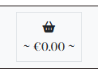
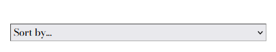
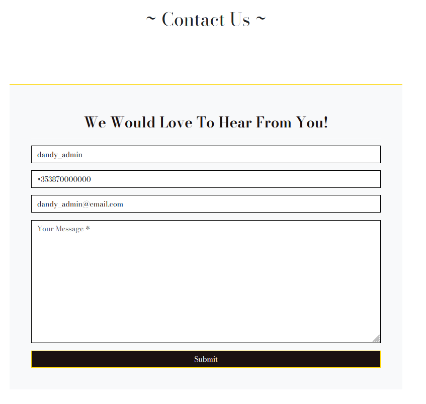
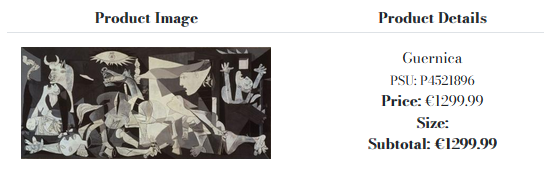

# Dandy Flaneur – Portfolio Project 5

## [Link to live web application](#)

---

## Project Documentation
### Welcome to [Dandy Flaneur](#)

---

## Table of Contents

-   [User Experience (UX)](#user-experience-ux)
    -   [Target Audiance](#target-audiance)
    -   [User Stories](#user-stories)
    -   [Typography](#typography)
    -   [Colour Palette](#colour-palette)
    -   [Wireframes](#wireframes)

-   [Agile Development](#agile-development)
    -   [MoSCow](#moscow-prioritization-system)

- [Technical Design](#technical-design)
    -   [Flowchart](#flowchart)
    -   [Data Model](#data-model)

-   [Website Features](#website-features)
    -   [Application Elements](#application-elements)

-   [Future Features](#future-features) 

-   [Testing](#testing)
    -   [Manual Testing](#manual-testing)
        -   [User Stories Testing](#user-stories-testing)
    -   [Automated Testing](#automated-tests)
        -   [Unit Tests](#unit-tests)
    -   [Performance](#performance)

-   [Validation](#validation)
    -   [HTML](#html)
    -   [CSS](#css)
    -   [JavaScript](#javascript)
    -   [Python](#python)

-   [Bug Fixes](#bug-fixes)

-   [Deployment](#deployment)
    -   [Local Deployment](#local-deployment)
    -   [Heroku Deployment](#heroku-deployment)

-   [Technologies Used](#technologies-used)
    -   [Hardware](#hardware)
    -   [Software](#software)
    -   [Platforms](#platforms)
    -   [Libraries](#libraries)
        -   [Local Libraries](#local-libraries)
        -   [Third Party Libraries](#third-party-libraries)

-   [Credits and References](#credits-and-references)
    -   [Repositories](#repositories)
    -   [Code Troubleshooting](#code-troubleshooting)
    -   [Documentation](#documentation)
    -   [Library Information](#library-information)
    -   [Theory](#theory)

-   [Acknowledgements](#acknowledgements)

-   [Closing Remarks](#closing-remarks)

---

## User Experience (UX)

### Target Audiance

This project primarily focuses on art enthusiasts that are looking to purchase a painting and related products online.

### User Stories

#### EPIC #1 - User Registration and Accounts

`(MUST HAVE)`

- As a user I can login and logout so that I can access a personal account on the site for rapid access to relevant shop features.
- As a user I can create and view a profile page so that I input and save relevant personal information for faster checkouts.
- As a user I can register an account on the site so that I have a personal account with a unique profile.
- As a user I can reset my password so that I can set a new password for my account whenever I need to do so.
- As a user I can be sent a confirmation email from the site once I create an account so that I am notified that my account registration was successful.

#### EPIC #2 - Site Viewing and Navigation

`(MUST HAVE)`

- As a shopper, I can navigate across the site so that I can access all relevant elements of the site.
- As a shopper I can use header and footer to access navigation, menus and Social Media links.
- As a shopper I can receive a dedicated notification in response to my actions so that I get real-time feedback about the status of my actions.
- As a shopper I can access a list of products available so that I can choose an item to buy.
- As a shopper I can view a welcome page so that I am introduced to the business and its products.
- As a shopper I can access details for a specific product so that I can better inform myself about the item to help with making a purchase decision.
- As a shopper I can view a readout of my login status that is visible at all times so that I can confirm my authentication whenever I want.
- As a shopper I can add new items to my basket so that I list the items that I want to buy.
- As a shopper I can view available booking times for workshops so that I can decide if they fit my schedule.
- As a shopper I can view a list of workshop classes so that I can easily inform myself of the experiences available on offer.
- As a shopper I can make changes in my basket so that I can make the exact purchase that I want.
- As a shopper I can remove items so that I don't accidentally purchase items that I don't want.
- As a shopper I can submit my email with a message attached so that I can establish a personal correspondence with the company about a specific topic.

`(SHOULD HAVE)`

- As a shopper I can view a page with all the relevant details of a workshop so that I can decide if it fits my interests.
- As an admin I can post, edit and remove blog content so that users can read about various topics relevant to the context of the site.
- As a user I can view well-formated layouts so that I can have a coherent visual experience while using the website.

`(COULD HAVE)`

- As a user I can leave comments on blog articles so that I can share my views and opinions about the matters discussed in the blog posts.
- As a viewer I can leave likes so that I can express my fondness for a blog post anonymously.

#### EPIC #3 - Content Sorting and Searching

`(MUST HAVE)`

- As a shopper I can put in keywords into a search bar so that I receive a page with all relevant products to my interests.

`(SHOULD HAVE)`

- As a shopper I can search for a specific item by entering its name or description so that I can precisely find the product that I am looking for.
- As a shopper I can sort products on the basis of their assigned categories so that I can focus on items that fit into categories that I am interested in.
- As a shopper I can sort products by price so that I can easily view products that are appropriate to my financial capabilities.

#### EPIC #4 - Stripe Payments and Checkout

`(MUST HAVE)`

- As a shopper I can easily access my shopping bag so that I can check the items that I will be purchasing whenever I need to.
- As a shopper I can receive a notification about the status of my order confirmation so that I am sure my payment went through and my order was placed successfully.
- As a shopper I can use my card to pay for my order so that I don't have to worry about alternative payment methods.
- As a shopper I can select the specific size and quantity preferences on the product page so that I can put exactly what I want in my shopping basket.

`(SHOULD HAVE)`

- As a shopper I can increase or decrease the quantities of items in my basket so that I can buy more or less of the product I want.

`(COULD HAVE)`

- As a shopper I can receive an email confirming my order with relevant details so that I can be sure that my order was processed successfully.

#### EPIC #5 - Administrator Features and Store Management

`(MUST HAVE)`

- As an admin I can add a new product so that I can update items available in the shop. 
- As an admin I can remove a product item from the store so that users don't have access to inactive products.
- As an admin I can change product details so that the relevant item has the most accurate and up-to-date information associated with it on the website.

`(COULD HAVE)`

- As an admin I can add a workshop so that users can view new experiences.
- As an admin I can change the details of a workshop as needed so that they represent the most accurate and relevant information to the users.
- As an admin I can remove a redundant workshop from the website so that users are not misled into inactive workshops.
- As an admin I can add more time slots to workshops so that users can benefit from added time availability.
- As an admin I can change booking time slot information so that users have the most accurate information.
- As an admin I can remove time slots as needed so that workshop details represent the most accurate availability information.

#### EPIC #6 - Web Marketing and Search Engine Optimization

`(MUST HAVE)`

- As a shopper I can find the correct site by searching it online so that I don't have to worry about opening an unrelated website.
- As a shopper I can submit my email so that I can receive information about deals and product insights from the company.

### Typography

- [Bodoni Moda](https://fonts.google.com/specimen/Bodoni+Moda?query=Bodoni+Moda) is the primary font that is present across all textual elements present in the project.
    - 

- [EB Garamond](https://fonts.google.com/knowledge/glossary/sans_serif) is the fallback font set in case the primary font fails.
    - 

### Colour Palette

[Coolors](https://coolors.co/) was a highly beneficial resource that provided significant help in identifying matching colours that also have appropriate contrast.

More importantly, this colour combination consists of items designed to motivate excitement and aesthetic pleasure from users through the use of minimalist design elements coupled with a clean page formating.

---

### Wireframes

Home Page

#### Mobile

#### Tablet

#### Desktop

Blog Page

#### Mobile

#### Tablet

#### Desktop

Blog Detail Page

#### Mobile

#### Tablet

#### Desktop

Store Page

#### Mobile

#### Tablet

#### Desktop

Store Detail Page

#### Mobile

#### Tablet

#### Desktop

Contact Us Page

#### Mobile

#### Tablet

#### Desktop

Basket Page

#### Mobile

#### Tablet

#### Desktop

Checkout Page

#### Mobile

#### Tablet

#### Desktop

Checkout Success Page

#### Mobile

#### Tablet

#### Desktop

Forms Page

- These wireframes illustrate the fundamental layout used in forms with one or more of editing, adding, and deletion functionalities.

#### Mobile

#### Tablet

#### Desktop

Authentication Page

- These wireframes represent the base design of all authentication pages that feature login, logout, and signup functionalities.

#### Mobile

#### Tablet

#### Desktop

Profile Page

#### Mobile

#### Tablet

#### Desktop

---

## Agile Development

### MoSCoW Prioritization System

This project relies on agile methodology for its task management. This allows for more accurate estimation of time needed for successful task completion. You can access the kanban board used for this project [here](https://github.com/users/beratzorlu/projects/4/views/1)

Below are the labels used on GitHub to illustrate the various importance levels.

- Must Have: MVP feature (60% of user stories)
- Should Have: secondary importance (20% of user stories)
- Could Have: Tertiary importance (20% of stories)
- Won't Have: No longer in consideration

---

## Technical Design

### Data Model - Entity Relationship Diagram

[Draw.io](https://www.drawio.com/) was a highly beneficial resource that provided significant help in building a ERP to illustrate the various table relationships of data models present in the project.

---

## Website Features

The design considerations that impacted the envisioned features were mainly structured around user interaction and content sharing. While there were more features planned in the initial stages of the project, some were not entertained to the benefit of serving the needs referenced in the [User Stories](#user-stories) section. Thus, it was important to focus on a minimum viable project rather than prioritizing the implementation of further features for the sake of it. This would only bloat the application without adding much real value to the user experience overall. There are [records available](#future-features) as a part of this documentation that demonstrate the change in scope that took place moving further into development.

### Application Elements

The below elements are available to be experienced by the user across the application as a whole.

| Feature | Screenshot |
| --- | --- |
| (Toasts) |  |
| (Homepage) |  |
| (Homepage Banner) |  |
| (Homepage Cards) |  |
| (Navbar) |  |
| (Navbar Links) |  |
| (Navbar Search) |  |
| (Navbar Login/Logout) |  |
| (Navbar Admin) |  |
| (Navbar Basket) |  |
| (Navbar Full Basket) |  |
| (Navbar Active User) |  |
| (Navbar Logo) |  |
| (Footer) |  |
| (Footer Links) |  |
| (Footer Newsletter) |  |
| (Footer Social Media) |  |
| (Footer Copyright) |  |
| (Store) |  |
| (Store Sort) |  |
| (Store Sort Active) |  |
| (Store Item Count) |  |
| (Store Item Count Active) |  |
| (Store Categories) |  |
| (Store Categories Reset) |  |
| (Store Card) |  |
| (Store Card Admin) |  |
| (Store Alert) |  |
| (Back to top button) |  |
| (Store Item) |  |
| (Store Item Quantity) |  |
| (Store Item Update/Remove) |  |
| (Store Item Info) |  |
| (Store Item Edit) |  |
| (Store Item Create) |  |
| (Blog) |  |
| (Blog Introduction) |  |
| (Blog Edit) |  |
| (Blog Delete) |  |
| (Blog Create) |  |
| (Blog Body) |  |
| (Blog Comments) |  |
| (Blog Comments Edit) |  |
| (Blog Comments Delete) |  |
| (Blog Comments Create) |  |
| (Blog Card) |  |
| (Blog Admin) |  |
| (Contact) |  |
| (Contact Success) |  |
| (Profile) |  |
| (Profile User Details) |  |
| (Profile Order History) |  |
| (Basket) |  |
| (Basket Quantity) |  |
| (Basket Payment) |  |
| (Basket Quantity) |  |
| (Checkout) |  |
| (Checkout Order Summary) |  |
| (Checkout Success) |  |
| (Checkout Payment Form w/ Stripe) |  |
| (Authentication Login) |  |
| (Authentication Logout) |  |
| (Authentication Signup) |  |
| (Authentication Verify Email) |  |

---

## Future Features

This section documents the features that were taken out of consideration for the benefit of the completion of the minimum viable project. The central observation in this area is that the level of ambition that the project initially set out with does not match with the intellectual labour required to complete a significant sum of the features first assigned. Below, are user stories that were deemed no longer necessary. You can view the full kanbar board used for project planning [here](https://github.com/users/beratzorlu/projects/4/views/1).

That being said, these features remain relevant to the overall scope of the project and it would see them expand its functional capacity in the future if the situation allowed it.

| Label | Feature |
|---|---|
| Won't Have | As a Shopper, I can view available booking times for workshops so that I can decide if they fit my schedule. |
| Won't Have | As a Shopper, I can view a list of workshop classes so that I can easily inform myself of the experiences available on offer. |
| Won't Have | As a Shopper, I can view a page with all the relevant details of a workshop so that I can decide if it fits my interests. |
| Won't Have | As an Admin, I can add a workshop so that users can view new experiences.                                  |
| Won't Have | As an Admin, I can change the details of a workshop as needed so that they represent the most accurate and relevant information to the users. |
| Won't Have | As an Admin, I can remove a redundant workshop from the website so that users are not misled into inactive workshops. |
| Won't Have | As an Admin, I can add more time slots to workshops so that users can benefit from added time availability. |
| Won't Have | As an Admin, I can change booking time slot information so that users have the most accurate information. |
| Won't Have | As an Admin, I can remove time slots as needed so that workshop details represent the most accurate availability information. |

---

## Testing

### Automated Testing

#### Unit Tests

| Scope | Screenshot | Result |
| --- | --- | --- |
| Global |   | Pass |

### Manual Testing

#### User Stories Testing

| **Feature**   |  **Screenshot**          | **Result** |
| ------------- | ------------------------ | ----------------- |
| (-) |  | Pass |

### Performance

The Lighthouse tests returned an overall acceptable result considering the scope and purpose of the project. Most notably, the performance value appears to be the more lacking area compared to the rest of the parameters available on Lighthouse. Information gathered from the testing process indicates that these scores are a result of Cloudinary slowing down the loading times of the images. In future projects, more effective cloud solutions such AWS will help prevent the recurrance of similar results.

| **Page** | **Screenshot** |
| -------- | ------ |
| Home |  |
| Blog |  |
| Store |  |

---

## Validation

### HTML

| Page | Screenshot | Result |
| --- | --- | --- |
| Home |  | Pass |

### CSS

| File | Screenshot | Result |
| --- | --- | --- |
| style.css |  | Pass |

### JavaScript

| File | Screenshot | Result |
| --- | --- | --- |
| fade.js |  | Pass |

### PYTHON

| File | Screenshot | Result |
| --- | --- | --- |
| urls.py (main) |  | Pass |

---

## Bug Fixes

In this section, all bugs that cased errors that prevented the successful execution of the application and their relevant fixes are provided.

| **Bug** | **Fix** |
| ------- | ------- |
| (-) | [here](#). |

---

## Deployment

This application has been deployed by using the Heroku cloud platform. Please find below the neccessary procdures to replicate the deployment process.

You can find a [template](https://github.com/Code-Institute-Org/python-essentials-template) prepared by Code Institute that is designed to display this backend application in a modern web browser. This allows the project to be accessible for users without the need of any third party software other than an Internet browser application.

### Local Deployment 

Gitpod IDE is the development environment for this project.

If you wish to make copy of this repository locally, you can clone it by inputting the following code into your preferred integrated development environment (IDE):
- `git clone https://github.com/beratzorlu/AutoMate.git`

As anoher method, you can click below button to create your own workspace using this repository if you are using Gitpod.e

### Heroku Deployment

This project utilizes the services available at [Heroku](https://www.heroku.com). Heroku is a platform as a service (PaaS) that allows users to build, deploy, and control applications in a cloud environment.

Disclaimer: To be able successfully replicate the Heroku deployment process, it is highly reccomended that users setup an account on the platform prior to following the steps provided below.

- Select *New* in the top-right corner of your Heroku Dashboard after log-in.
- Select navigate to the *Create new app* button from the dropdown menu and select it.
- Assign a unique name to your application.
- Navigate to the *region* dropdown menu and select the region closest to you from either EU or USA. 
- Select *Create App*.
- Navigate to your newly created application and select *Settings*. 
- Click *Reveal Config Vars*.
- Add first *Config Var*.
- Set the value of KEY to `CREDS`, copy and paste the data in your credentials file (ie. creds.json) into the value area.
- Add second *Config Var*.
- Set the value of KEY to `PORT`, and the value to `8000` then select *add*.
- You need to add support to dependencies to be able to successfully deploy application, select *Add Buildpack*.
- The order in which you list your dependencies is critical, select `Python` as the first dependency.
- From the same menu, select `Node.js` after you select `Python`. (You can drag the list items upwards and downwards to change their order if needed.)
- Scroll until you find your desired deployment method, select `Enable Automatic Deploy` to rebuild your project automatically every time you push a new commit. Select `Manual Deployment` to manually deploy from your desired branch on will.*

*If you have selected automatic deployment, your application will only deploy after your first push to the system.

After the completion of this process, Heroku needs two files further to deploy successfully. These are;
    - requirements.txt
    - Procfile

To install your project's requirements use: `pip3 install -r requirements.txt`. 

If you have third party packages in your project the requirements file needs updated, use: `pip3 freeze --local > requirements.txt`

To create your Procfile, use: `echo web: node index.js > Procfile`

For Heroku deployment, follow these steps to connect your GitHub repository to the newly created app:

- In the Terminal (CLI), connect to Heroku using this: `heroku login -i`
- Set the remote for Heroku: `heroku git:remote -a <app_name>` (replace <app_name> with your chosen name for your application without the angle-brackets)
- Input commands `git add`, `git commit`, and `git push` to GitHub sequentially.
- Finally, type `git push heroku main` in the terminal to connect to Github.

Alternatively, you can connect to your Github account by following the below steps on Heroku's platform.

- Navigate to your Heroku account dashboard.
- Find the relevant project and click on its icon.
- On the next page, navigate to the `Deploy` subsection.
- Scroll down until you find `Deployment method` and find `Use Github`.
- Finally, input your Github account credentials to complete the process. 

---

## Technologies Used

### Hardware

- Monster Abra A5 V13.4 15.6" Laptop
- Lenovo IdeaPad 3i 14" Laptop
- Samsung VA 1920x1080 144Hz Curved Gaming Monitor
- iPhone 11
- Ipad Air 5th Generation
- Samsung A51

### Software

- Mozilla Firefox: Main browser used for development, testing and device simulation.
- Google Chrome: Secondary browser for testing and device simulation.
- Microsoft Edge: Tertiary browser for testing.
- Firefox Mobile: Mobile testing of the deployed site.
- Chrome Mobile: Mobile testing of the deployed site.
- Safari Mobile: Mobile testing of the deployed site.
- Windows Snip & Sketch: Capturing screenshots for readme and archiving identified bugs.
- Microsoft Snipping Tool: Fallback screen capture software when MS Snip & Sketched became unresponsive.
- DiffChecker: Comparing code to identify issues, solutions and ideas.
- Python Checker: Checking the syntax of Python code.
- ElephantSQL: PosgresSQL database resource.
- Django: Fullstack framework used to build the project
- Bootstrap: Responsive frontend CSS framework used to design the visual aspects of the project.
- Cloudinary: Cloud storage for static files.
- Balsamiq: Wireframe design and rendering.
- Draw.io: Diagram design and rendering.

### Platforms

- GitHub: Version control and site deployment.
- GitPod: Integrated Development Environment (IDE) chosen for this project.
- Google Fonts: Finding and exporting third-party fonts for the website.
- CodePen: For quickly testing out ideas before carrying them to 
DevTools.
- Coolors: For creating a matching colour palette that has appropriate contrast.
- Heroku: Cloud platform used for deploying project.
- Canva: Graphic design platform used for custom visual elements.

### External Modules

| **Name** | **Version** |
| ------- | ------- |
| asgiref | 3.6.0 |
| Babel | 2.12.1 |
| cloudinary | 1.32.0 |
| dj-database-url | 0.5.0 |
| dj3-cloudinary-storage | 0.0.6 |
| Django | 3.2.18 |
| django-allauth | 0.54.0 |
| django-crispy-forms | 1.14.0 |
| django-phonenumber-field | 7.1.0 |
| django-summernote | 0.8.20.0 |
| gunicorn | 20.1.0 |
| oauthlib | 3.2.2 |
| phonenumbers | 8.13.11 |
| psycopg2 | 2.9.6 |
| PyJWT | 2.6.0 |
| python3-openid | 3.2.0 |
| pytz | 2023.3 |
| requests-oauthlib | 1.3.1 |
| sqlparse | 0.4.4 |

---

## Credits and References

### Repositories

(-)

### Code Troubleshooting

| Source | Title | URL |
| --- | --- | --- |
| Stack Overflow | (-) | [here](#)

### Documentation

| Source | Title | URL |
| --- | --- | --- |
| Django | (-) | [here](#) |

### Tutorials

| Source | Title | URL |
| --- | --- | --- |
| (-) | (-) | [here](#) |

### Articles

These article samples were taken from third party resources to prepopulate the website with blogs that present organic content.

(-)

### Library Information

- [The Python Package Index (PyPI)](https://pypi.org/): PyPI was critical in accessing libraries that added functionality to the project that otherwise would be impossible to feature in the end product.

- [Code Insitute](https://codeinstitute.net/ie/): The theory available in the Code Institute curriculum has been central in successfully setting up and utilizing Google Cloud API services for this project.

### Theory

- [UCD Professional Academy](https://www.ucd.ie/professionalacademy/): I would like to thank UCD PA for their facilitator and masterclass sessions in partnership with Code Insitute. These have been invaluable in better understanding relevant theory and practice elements.

---

## Acknowledgements

(-)

--- 

## Closing Remarks

(-)

---
 [Back to Top](#table-of-contents)